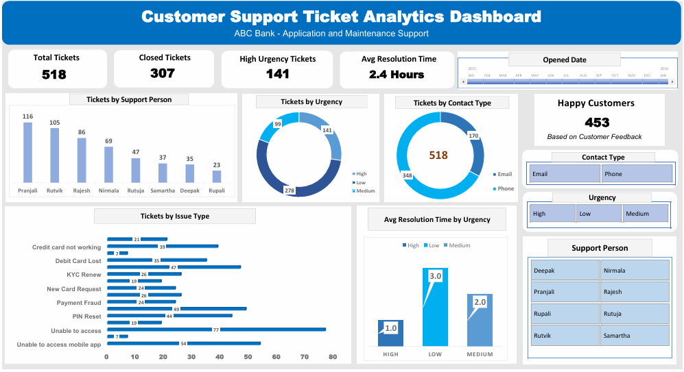

# Customer Support Analytics Dashboard

## Project Overview

Developed an interactive Customer Support Analytics Dashboard using Microsoft Excel to analyze ticket volume, urgency trends, resolution time, and overall customer support performance. The project demonstrates data analysis, KPI reporting, and interactive dashboard development using Pivot Tables, Pivot Charts, slicers, and Excel features.

---

## Dashboard Preview

---

## Tools & Skills

- Microsoft Excel
- Pivot Tables
- Pivot Charts
- Slicers
- Conditional Formatting
- Excel Functions
- Data Analysis
- Reporting
- Data Visualization
- Dashboard Development

---

## Key Metrics

- Total Tickets: **518**
- Closed Tickets: **307**
- High-Urgency Tickets: **141**
- Average Resolution Time: **2.4 Hours**
- Happy Customers: **453**
- Contact Types: **Email | Phone**

---

## Key Insights

- Analyzed **518 customer support tickets** to evaluate service performance.
- Tracked ticket volume, urgency trends, and average resolution time.
- Identified **141 high-urgency tickets** requiring priority support.
- Evaluated issue categories, support person performance, and contact type distribution.
- Enabled quick operational insights through interactive dashboards, KPIs, slicers, and filters.

---

## Files Included

- Excel Dashboard.xlsx
- customer-support-ticket-analytics-dashboard.png
- Customer Support Ticket Analytics Dashboard.pdf

---

## Purpose

This project was created to strengthen Excel-based data analysis, reporting, dashboard development, and business reporting skills while building a practical analytics portfolio.
